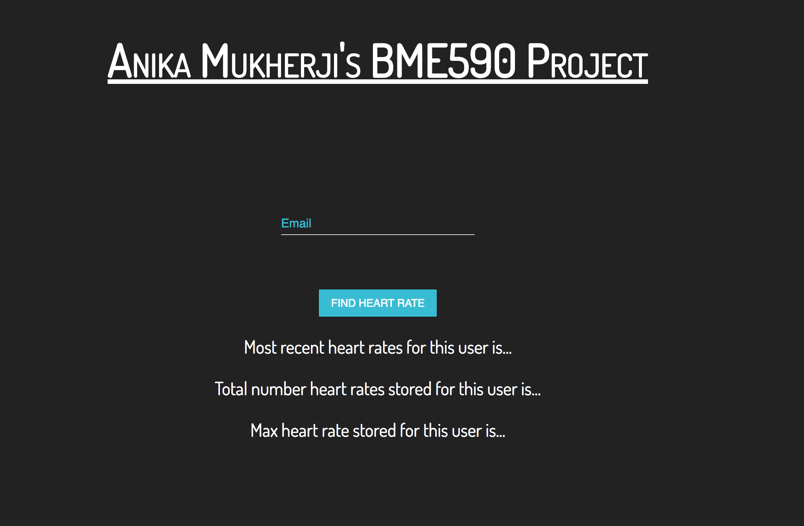
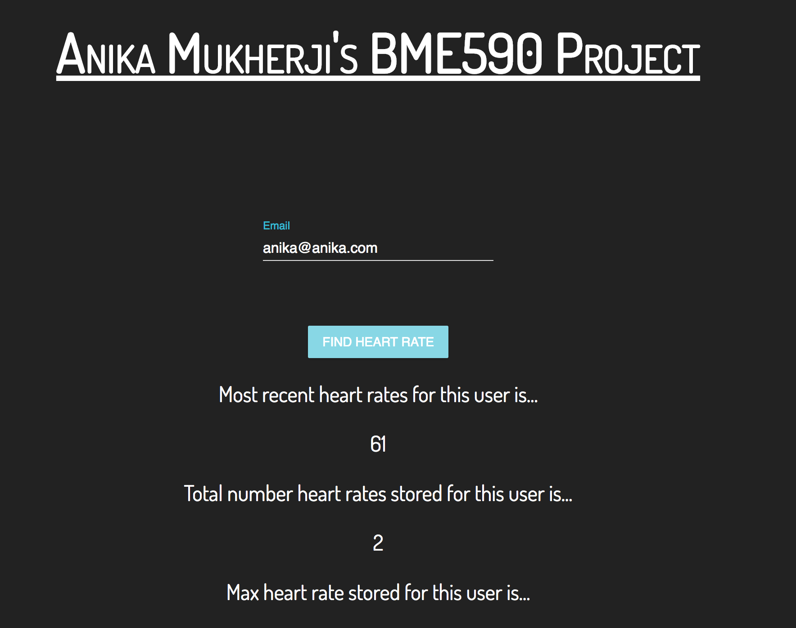
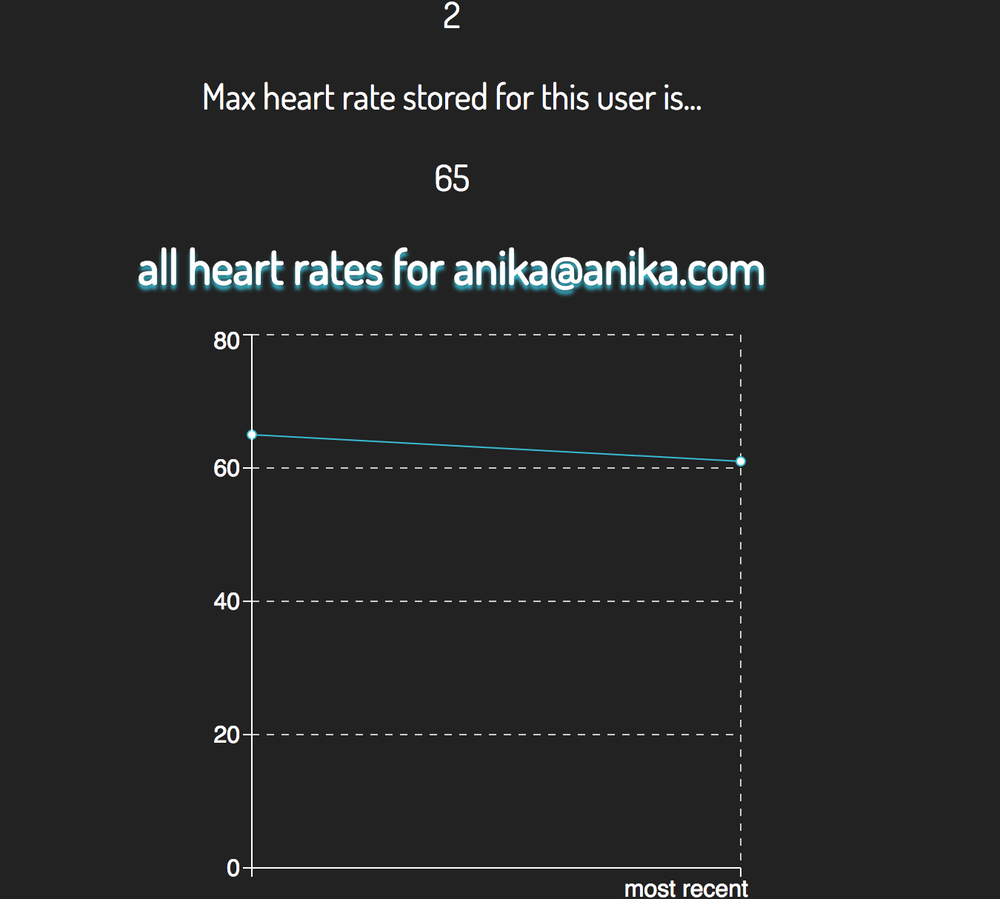

# Anika Mukherji's BME590 React App Project

Little React app for a school project that calls [this](https://github.com/anikamukherji/heart_rate_databases_introduction) server, which is running on my Duke VM. This app basically just retrieves two emails, anika@anika.com and anika2@anika.com and then shows the most recent heart rate stored, the total number of heart rates stored, and then graphs all heart rates stored for that user.
If you would like to run this app...
```
git clone https://github.com/anikamukherji/doctor-hr-frontend.git
```
```
cd doctor-hr-frontend
```
```
npm install
```
```
npm run start
```

If you want to add your own emails and heart rates, you can go to [this repo](https://github.com/anikamukherji/heart_rate_databases_introduction) and clone it...
```
git clone https://github.com/anikamukherji/heart_rate_databases_introduction.git
```
```
cd heart_rate_databases_introduction
```
```
pip3 install -r requirements.txt
```
Then you can open up the `requests_test.py` file and change the scripts to your desired email and heart rates. Then you can run
```
python3 requests_test.py
```
which will add your heart rates to the database.


Here are some images of the app: 






